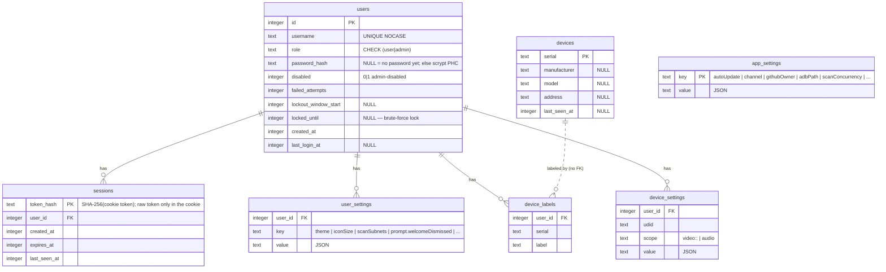

# SQLite persistence + users/auth — design

- **Date:** 2026-06-11
- **Status:** Approved (brainstorm complete) — pending implementation plans
- **Items:** `todo_ws_scrcpy_web` #34 (cross-platform device-name DB), #36 (single SQLite store for all persistence), #37 (localStorage → SQLite), #54 (users / auth subsystem)
- **Branch / worktree:** `auth-sqlite-spec` @ `C:/Users/jscha/source/repos/ws-scrcpy-web-auth-sqlite-spec` — a dedicated spec worktree. **Design only — no app code in this branch.**
- **Ships as:** four phased implementation plans (foundation → device store → settings migration → auth), each its own beta. A parallel session is building the **beta.62** Settings restructure; phases 3–4 touch the Settings modal and so their *implementation* rebases onto / lands after beta.62.

---

## Problem

The app's persistence is fragmented and fragile across three mechanisms:

1. **`config.json`** — a flat JSON file read by the Node server (`src/server/Config.ts`, the full field set) **and** the Rust launcher + tray at boot (`common/src/config.rs`, three fields), plus seeded by the Velopack install hook. Non-transactional; a partial write can corrupt it.
2. **`device-labels.json`** — a separate `Record<serial,string>` file (`src/server/DeviceLabelStore.ts`). "Device-name tracking is loose" (item 34).
3. **`localStorage`** — per-origin browser storage that is **unreliable on Linux AppImage** (the browser can treat each launch as a different origin and lose prefs — the same fragility that already forced `bookmarkDismissed*` and the service first-run flags out of localStorage and into `config.json`). Holds icon-size, video/stream, audio, scan-subnet, and theme prefs.

Separately, the app has **no authentication layer** (greenfield — verified 2026-06-11; the only "auth" in `src/server` is ADB's AUTH packet, pkexec credentials, and Windows session enumeration). It is wide open to anyone who can reach the web port, including the WebSocket device/video/audio streams.

The locked direction (item 36, user 2026-06-01) is **one SQLite store** in `dataRoot` for all of this, with **user accounts + password hashes living in that store** (item 54, user 2026-06-11) — never on the frontend-PATCHable `/api/config` surface.

## Goals

1. **One SQLite store** (`<dataRoot>/wsscrcpy.db`) is the single home for all application settings, device data, users, and sessions — transactional, typed, origin-independent.
2. **Local-Dependencies-Only compliant** engine: `node:sqlite` (compiled into the bundled Node — no native addon, no vendored prebuilt).
3. **Optional, opt-in auth** that is inert until the first real user is added, then locks the **entire** app (HTTP routes **and** the WebSocket upgrade) behind login, with exactly two roles — `user` and `admin`.
4. **Per-user settings** — each user's theme, device names, per-device stream settings, icon size, scan subnets, and dismissed prompts are their own; a per-user "reset my settings" clears only the caller's.
5. **Lossless migration** of every existing reader/writer (config.json non-boot fields, device-labels.json, all localStorage groups) into the store, once, idempotently.
6. **The fragile cross-process boot path stays untouched** — the launcher, tray, and install hook continue reading the three boot-critical fields from a tiny `config.json`; no `rusqlite`, no Rust-reads-SQLite-at-boot.

## Non-goals

- **No `rusqlite` in the launcher/tray** and no change to `common/src/config.rs` (see the boot-skeleton decision). The boot trio is the explicit carve-out from "SQLite for all."
- **No per-user *device-stream* sharing model beyond udid+user** — per-device settings are keyed `(user, udid, scope)`; there is no cross-user sharing or inheritance.
- No in-browser SQLite access — the browser talks HTTP only; the Node server owns the DB.
- No Docker-specific work (item 2 is a separate release).

---

## Locked decisions (this brainstorm, 2026-06-11)

| # | Decision | Rationale |
|---|---|---|
| D1 | **One design spec, four phased plans** (foundation → device store → settings migration → auth). | The four subsystems share one DB (can't be schema-designed piecemeal) but implement/review best in layers. |
| D2 | **Tiny `config.json` boot skeleton** holds exactly `{ installMode, webPort, firstRunComplete }`; SQLite owns everything else. `config.rs`, the tray, and the Velopack install hook are **unchanged**. | The boot trio is special — three processes need it before the DB layer is alive. Keeping it in the JSON that already works avoids adding `rusqlite` to two more binaries and a Rust-reads-a-WAL/mid-migration-DB-at-boot failure surface. "SQLite for all" = all *application* settings/state; bootstrap metadata is separate. |
| D3 | **Most settings are per-user**, not global/shared: theme, device naming, per-device stream/audio, icon size, scan-subnet list, dismissed prompts. (Refines items 34/37, which assumed shared/udid-keyed.) | User direction 2026-06-11. |
| D4 | **Admin-only (global / instance-wide):** `webPort`, updates/channel, **Dependencies** (Node/adb/scrcpy-server management), service install, app uninstall, global `app_settings` (incl. scan-tuning knobs). Device **scanning** (quick + full subnet) is available to **all** users. | User direction 2026-06-11. Admin-only Settings sections are **hidden entirely** from regular users, not merely disabled. |
| D5 | **Airtight admin password.** Adding the first real user *requires* the admin to set their password in the same flow; the lock engages only once a real admin password exists — **no password-less window**. | User pick 2026-06-11. Honors "the admin needs a password to lock the app down" literally. |
| D6 | **Admin sets initial passwords** for new users (and can reset them); **users can change their own password** from Settings. No first-login-set flow. | User pick 2026-06-11 (self-service change added same day). |
| D7 | **DB-backed opaque sessions** (httpOnly cookie holds a random token; the server stores its hash). Not stateless JWT. | Real revocation, no signing-key management, survives restart. |
| D8 | **Shared `devices` observed-metadata table is in v1** (item 34's richer tracking — manufacturer/model/last-seen/address), distinct from the per-user `device_labels`. | User direction 2026-06-11. |
| D9 | **Engine: `node:sqlite`** (`DatabaseSync`), gated by an up-front **verification spike** on the bundled Node 24.15.0. | Local-Deps. Fallback `better-sqlite3` reintroduces the node-pty prebuilt-matrix problem, so it is the design target, not the default. |
| D10 | **Account controls in v1:** admin can **disable** a user (checkbox; can't disable the last enabled admin); **login lockout** after 5 failed attempts in a rolling 5-min window, auto-unlock after 15 min of no attempts; **admin can clear a lockout immediately** (override the 15-min wait). | User direction 2026-06-11. |
| D11 | **Reversible lock:** an explicit `app_settings.authEnabled` flag gates enforcement; an admin can turn login back **off** (return to open mode) and on again (re-enable requires ≥1 enabled admin with a password). | User direction 2026-06-11 (supersedes the earlier "one-way" lock). |

---

## Architecture

**One DB file:** `<dataRoot>/wsscrcpy.db`, opened only by the Node server. The browser never touches SQLite (HTTP surface only, mirroring today's `/api/config`); the Rust launcher/tray never touch it (boot trio stays in `config.json`). **Node is the sole reader and writer** — which is what makes WAL + single-writer safe with no cross-process locking.

**Engine:** `node:sqlite` `DatabaseSync` (synchronous API). On Node 24.15.0 it is usable **without** a flag but emits a cosmetic `ExperimentalWarning` on first use; the verification spike (Phase 1, task 1) confirms the exact API surface and picks the cleanest warning suppression that does **not** rely on binary-path resolution (candidate: `--disable-warning=ExperimentalWarning` on the launcher's node argv + the dev supervisor; or a narrow in-process `process.on('warning')` filter).

**Layering:**
- **`Db` singleton** (`src/server/db/Db.ts`) — opens the file; sets `PRAGMA journal_mode=WAL`, `busy_timeout=5000`, `foreign_keys=ON`; runs migrations on open; exposes prepared-statement helpers. Same singleton shape as `Config.getInstance()`.
- **Repositories** (thin, typed, independently testable): `UserStore`, `SessionStore`, `UserSettingsStore`, `DeviceStore` (covers `devices`, `device_labels`, `device_settings`), and an `AppSettingsStore` for the global table.
- **HTTP surface** (same `HttpServer.addApiHandler` pattern as every current API): new `AuthApi`, `UsersApi`, `SettingsApi`; the existing `ConfigApi` retargets the **global** app settings to `app_settings` (admin-gated) and keeps the boot trio on the slim config path.

**Boot skeleton:** `config.json` shrinks to `{ installMode, webPort, firstRunComplete }`. `Config.ts` splits into (a) a slim **boot-config** that still reads/writes that trio in JSON — including `setActualWebPort`'s auto-shift and the service-install paths' `installMode` writes — and (b) the rest of today's `AppConfig`, which becomes store-backed: global fields → `app_settings`; prompt-dismissal flags → **per-user** settings. `common/src/config.rs` and the install hook continue to read the trio exactly as today.

---

## Data model

`PRAGMA user_version` carries the schema version (v1 = the schema below). No separate bookkeeping table.



**DDL (v1):**

```sql
CREATE TABLE users (
    id                   INTEGER PRIMARY KEY,
    username             TEXT    NOT NULL COLLATE NOCASE UNIQUE,
    role                 TEXT    NOT NULL CHECK (role IN ('user','admin')),
    password_hash        TEXT,            -- NULL only for the implicit admin before lockdown
    disabled             INTEGER NOT NULL DEFAULT 0,   -- admin-disabled account
    failed_attempts      INTEGER NOT NULL DEFAULT 0,
    lockout_window_start INTEGER,         -- start of the current 5-min failed-attempt window
    locked_until         INTEGER,         -- when set and now < it, login is locked
    created_at           INTEGER NOT NULL,
    last_login_at        INTEGER
);

CREATE TABLE sessions (
    token_hash   TEXT    PRIMARY KEY,    -- SHA-256(raw cookie token), hex
    user_id      INTEGER NOT NULL REFERENCES users(id) ON DELETE CASCADE,
    created_at   INTEGER NOT NULL,
    expires_at   INTEGER NOT NULL,
    last_seen_at INTEGER NOT NULL
);
CREATE INDEX idx_sessions_user ON sessions(user_id);

CREATE TABLE user_settings (
    user_id INTEGER NOT NULL REFERENCES users(id) ON DELETE CASCADE,
    key     TEXT    NOT NULL,
    value   TEXT    NOT NULL,            -- JSON-encoded
    PRIMARY KEY (user_id, key)
);

CREATE TABLE devices (
    serial       TEXT PRIMARY KEY,
    manufacturer TEXT,
    model        TEXT,
    address      TEXT,
    last_seen_at INTEGER
);

CREATE TABLE device_labels (
    user_id INTEGER NOT NULL REFERENCES users(id) ON DELETE CASCADE,
    serial  TEXT    NOT NULL,            -- no FK to devices.serial: a label may precede observation
    label   TEXT    NOT NULL,
    PRIMARY KEY (user_id, serial)
);

CREATE TABLE device_settings (
    user_id INTEGER NOT NULL REFERENCES users(id) ON DELETE CASCADE,
    udid    TEXT    NOT NULL,
    scope   TEXT    NOT NULL,            -- 'video:<display>:<window>' | 'audio'
    value   TEXT    NOT NULL,            -- JSON-encoded
    PRIMARY KEY (user_id, udid, scope)
);

CREATE TABLE app_settings (
    key   TEXT PRIMARY KEY,
    value TEXT NOT NULL                  -- JSON-encoded
);

-- Seed the implicit admin (open mode: no password → no login).
INSERT INTO users (id, username, role, password_hash, created_at)
VALUES (1, 'admin', 'admin', NULL, <unixMillis>);

-- Auth starts disabled (open mode) until the lockdown flow enables it.
INSERT INTO app_settings (key, value) VALUES ('authEnabled', 'false');
```

**Design choices:**
- **Per-user settings are generic key/value (JSON values), not typed columns** — the five localStorage groups are heterogeneous and will grow; KV absorbs new prefs without a migration each time. The repository layer provides typed getters/setters so callers stay type-safe.
- **`device_labels` is per-user** (`(user_id, serial)`); **`devices`** holds shared observed facts upserted by the scanner/tracker and read by everyone via the device list. **No FK** between them so a label can exist before a device is first observed.
- **`sessions` stores `SHA-256(token)`**, never the raw token — a DB leak can't resurrect live sessions.
- **`adbPath` / `dependenciesPath` / scan-tuning** (`scanConcurrency`/`scanTcpTimeoutMs`/`scanAdbConnectTimeoutMs`/`scanProgressInterval`) move to `app_settings` (admin/global). They are not boot-critical (the launcher reads none of them).

---

## Role model & capability map

Identity is the `users` table; it is **independent of OS accounts** (relevant in system-service mode — see below). Exactly two roles.

| Capability | Regular `user` | `admin` |
|---|:--:|:--:|
| Connect to / control devices | ✓ | ✓ |
| Scan for devices — quick **and** full subnet | ✓ | ✓ |
| Own **theme** (per-user) | ✓ | ✓ |
| Own **device labels** (per-user naming) | ✓ | ✓ |
| Own **per-device stream/audio** settings | ✓ | ✓ |
| Own **file-browser icon size** | ✓ | ✓ |
| Own **scan-subnet list** | ✓ | ✓ |
| Own **dismissed prompts** + **reset my settings** | ✓ | ✓ |
| **Change own password** | ✓ | ✓ |
| **Users management** (add/remove/role/reset pw, **disable**, **unlock**) | — | ✓ |
| **Enable/disable auth** (open-mode toggle) | — | ✓ |
| `webPort` | — | ✓ |
| Updates / channel / check-for-updates | — | ✓ |
| **Dependencies** (Node/adb/scrcpy-server) | — | ✓ |
| Service install · app uninstall | — | ✓ |
| Global `app_settings` (incl. scan-tuning) | — | ✓ |

Admin-only Settings sections are **hidden** for regular users (not just disabled), and their endpoints return **403** regardless of UI state.

---

## Auth subsystem

**Identity model.** A `users` row exists from first run: the **implicit admin** (`id=1`, `role=admin`, `password_hash=NULL`, default username `admin`). Enforcement is governed by an explicit **`app_settings.authEnabled`** flag (default `false`).
- **Open mode** (`authEnabled=false`) = no login required (today's behavior). Every request is implicitly `user_id=1` (the admin), so its settings apply and pre-auth prefs already live where they'll stay. If other user rows exist (auth was turned back off), they're **dormant** until re-enabled.
- **Locked mode** (`authEnabled=true`) = every HTTP route and WS upgrade requires a session. Set `true` by the lockdown transaction; an admin can flip it back to `false` to return to open mode, or on again — **re-enabling requires ≥1 enabled admin with a password**, so you can never lock everyone out.

**Lockdown flow (airtight — D5).** Admin → Settings → Users → "Add user." Because no admin password exists yet, the flow first presents **"Secure the admin account"**: confirm admin username + set password (single field, closed/open **eye toggle**). Required. On submit, **one transaction**: hash + store the admin password, create the new user (username + role + admin-set password), set `authEnabled=true` → locked. The admin's pre-lock settings (already at `user_id=1`) carry over seamlessly. After this, every HTTP route and WS upgrade requires a session.

**Sessions (D7).** `POST /api/auth/login {username,password}` verifies the scrypt hash (timing-safe). On success: mint a 256-bit random token, store `SHA-256(token)` in `sessions` with a **sliding 30-day** expiry (`last_seen_at` refreshed on use), set cookie `wsscrcpy_sid=<token>` — **httpOnly, SameSite=Lax, `Secure` when the server is https**, `Path=/`. Every request: middleware reads the cookie, hashes, looks up the session, checks expiry, attaches `req.user`. `POST /api/auth/logout` deletes the row + clears the cookie. Deleting a user cascades their sessions (instant revoke).

**Gating — both surfaces.**
- **HTTP:** an `AuthGate` handler registered **first** in `HttpServer.apiHandlers` (it runs before all others in `createRequestHandler`'s loop, and `handle()` returning `true` short-circuits). When locked and the request lacks a valid session, it serves the login page (for navigations) or `401` (for `/api/*`) and returns handled. **Allow-list:** the login page, its static assets, and `POST /api/auth/login`. Everything else — APIs, the app shell, the streams' HTTP handshake — requires a session. Admin-only routes additionally check `req.user.role === 'admin'` → `403`.
- **WS:** in `WebSocketServer.attachToServer`'s `connection` handler, **before** path/MW dispatch, validate the session from `request.headers.cookie`; when locked and invalid → `ws.close(4401, 'unauthorized')`. No MW is attached until after the check, so no device/stream data ever reaches an unauthenticated socket. *(Alternative considered: reject during the handshake via `ws`'s `verifyClient` or a `noServer` manual-upgrade. The connection-handler close is minimal-change and equally safe here because nothing is wired until after the check; the stricter form is a later hardening option.)*

**Password hashing.** `node:crypto` `scrypt` — `N=16384, r=8, p=1`, 64-byte key, 16-byte random salt — stored PHC-style `scrypt$16384$8$1$<saltB64>$<hashB64>`; verified with `crypto.timingSafeEqual`. Compiled into Node → Local-Deps clean. (Cost parameters tunable; documented in code.)

**Account controls (v1).**
- **Self-service password change** — `POST /api/auth/change-password {currentPassword,newPassword}` for any authenticated user; verifies the current password (timing-safe), stores the new scrypt hash. Surfaced as a control in the Settings modal.
- **Disable user** — admin sets `users.disabled=1` via `PATCH /api/users/:id {disabled}`; a disabled user fails login and has their sessions deleted immediately (instant kick). The **last enabled admin** cannot be disabled or deleted.
- **Login lockout (brute-force)** — tracked on `users` (`failed_attempts`, `lockout_window_start`, `locked_until`). Per attempt: (1) unknown username or `disabled` → generic reject; (2) `locked_until` set and `now < locked_until` → reject **and** push `locked_until = now + 15min` (the inactivity timer resets on every attempt while locked); (3) `locked_until` set and `now ≥ locked_until` → lock expired, clear counters, proceed; (4) verify — **success** clears counters + sets `last_login_at`; **failure** starts a fresh 5-min window if none/expired (`lockout_window_start=now, failed_attempts=1`) else increments, and at `failed_attempts ≥ 5` sets `locked_until = now + 15min`. Net: 5 fails within 5 minutes lock the account; it auto-unlocks after 15 minutes with no attempts. Exact transitions pinned by TDD. **Admin override:** an admin can clear a user's lockout immediately via `PATCH /api/users/:id {unlock:true}` (resets `locked_until` + `failed_attempts` + `lockout_window_start`) so the user can retry without waiting — locked-out users rarely wait the 15 minutes.
- **Reversible auth toggle** — admin `POST /api/auth/disable` (→ `authEnabled=false`, return to open mode) / `POST /api/auth/enable` (→ `true`; guarded by ≥1 enabled admin with a password). Sessions are left intact on disable (ignored in open mode) and honored again on re-enable.

**API surface (new).**
| Method · path | Role | Purpose |
|---|---|---|
| `POST /api/auth/login` | (open) | Authenticate, set session cookie |
| `POST /api/auth/logout` | any | Destroy session |
| `POST /api/auth/change-password` | any | Change own password (verifies current) |
| `GET /api/auth/me` | any | Current user `{username, role}` + `authEnabled` |
| `POST /api/auth/enable` · `/disable` | admin | Toggle `authEnabled` (lock / return to open mode) |
| `GET /api/users` | admin | List `{id, username, role, hasPassword, disabled, lockedUntil, lastLogin}` |
| `POST /api/users` | admin | Create `{username, role, password}` (the lockdown transaction when first) |
| `PATCH /api/users/:id` | admin | Change role / reset password / disable / **unlock** (clear lockout) |
| `DELETE /api/users/:id` | admin | Delete (refused if it would remove the last enabled admin) |
| `POST /api/settings/reset` | any | Clear the **caller's** `user_settings` + `device_labels` + `device_settings` (not the account) |

**Service mode (root, multi-user Linux).** App-level auth is **orthogonal** to which OS user the systemd service runs as. The `users` table is app identity; the DB lives in the service's `dataRoot` (`/var/opt/ws-scrcpy-web` for system scope). One served app instance, one user table — no interaction with OS accounts.

---

## Migration framework + data import

`Db` open reads `PRAGMA user_version`; if behind, it runs the pending step(s) inside a transaction and bumps the version (runs-once, all-or-nothing per step). The v0→v1 step creates the schema, seeds the implicit admin, and imports the three legacy sources:

- **`config.json`** → non-boot fields move out: global app fields (`autoUpdate`, `updateCheckIntervalMinutes`, `channel`, `githubOwner`, `adbPath`, `dependenciesPath`, scan-tuning) → `app_settings`; prompt/dismissal flags (`bookmarkDismissedForPort`, `bookmarkDismissedGlobally`, `serviceFirstRunSeen`) → the implicit admin's `user_settings`. The boot trio stays; `config.json` is rewritten **trimmed**.
- **`device-labels.json`** → `device_labels` rows for `user_id=1` + seed `devices` rows (serial; metadata fills in as devices are observed). Server-side, deterministic, inside the migration. The legacy file is left inert (cleanup optional).
- **`localStorage`** → lives in the **browser**, so this is **client-driven**: on first load post-upgrade, a one-time client module checks a `ws-scrcpy-web:migrated-to-sqlite` flag; if absent and legacy keys exist, it reads them, POSTs to the per-user settings surface, and on success sets the flag + removes the keys. In open mode this targets the implicit admin (`user_id=1`); users created after lockdown have nothing to import.

  | localStorage source | Key | Target |
  |---|---|---|
  | `ListFilesModal.ts` | `ICON_SIZE_KEY` | `user_settings['iconSize']` |
  | `BasePlayer.ts` (per udid/display/window) | video settings | `device_settings(user,udid,'video:<display>:<window>')` |
  | `AudioSettingsStore.ts` | `ws-scrcpy-web:audio:<udid>` | `device_settings(user,udid,'audio')` |
  | `ScanNetworkModal.ts` | `ws-scrcpy-web:scan-subnets` | `user_settings['scanSubnets']` |
  | `themeEmbed.ts` | `ws-scrcpy-web-theme` | `user_settings['theme']` (see below) |

- **Theme first-paint.** `themeEmbed.ts` stops reading localStorage. First paint reads `prefers-color-scheme` (no flash — it matches the OS) as a throwaway; once the app + session are up it applies the user's DB theme; on a user's first run the DB theme is **seeded** from that OS read, and thereafter SQLite is authoritative (user can override).

- **Reset semantics.** `POST /api/settings/reset` becomes "reset all of **my** settings" (theme, device labels, per-device stream/audio, icon size, scan subnets, prompts) — a superset of item 53's prompt-only reset (which currently lives in the Settings modal the beta.62 work is restructuring).

---

## Concurrency & integrity

- **WAL** + `busy_timeout=5000` + `foreign_keys=ON`. Node is the **sole** process on the DB, and `DatabaseSync` is synchronous, so statements never interleave — contention is a non-issue. WAL is chosen over the rollback journal for crash resilience.
- **On open:**
  - File missing → create + migrate from v0 + seed the implicit admin.
  - `PRAGMA integrity_check` fails → move the file aside (`wsscrcpy.db.corrupt-<timestamp>`), recreate, re-run the import from the still-present legacy files, log loudly.
  - `user_version` **greater** than the binary knows (a downgrade) → **abort with a clear message** rather than operate on an unknown schema (silent operation risks corruption). Downgrades are unsupported in v1.
- **Backup:** `VACUUM INTO '<dataRoot>/wsscrcpy.db.bak'` on graceful shutdown — a cheap last-good snapshot. (`gracefulShutdown` in `index.ts` is the hook.)

---

## Testing strategy (TDD per layer)

- **Migrations:** v0→v1 produces the expected tables/indexes; re-open is idempotent (no double-import); `user_version` bumps; a `user_version`-from-the-future aborts.
- **Repositories:** `UserStore` (create/find/role/last-login; can't-delete-last-admin); `SessionStore` (mint/validate/expire/revoke; stores the **hash** not the raw token); `UserSettingsStore`/`DeviceStore` per-user **isolation** (user A cannot read user B's rows); reset clears only the caller.
- **Auth:** scrypt hash/verify (known vectors + `timingSafeEqual`); the `authEnabled` gate; the **atomic** lockdown transaction (admin pw + new user + enable, all-or-nothing); cookie parse/validate/expiry; **login lockout** transitions (5-in-5-min locks; 15-min inactivity auto-unlock; success resets; **admin unlock** clears it); **disable user** blocks login + revokes sessions; **change-password** verifies current; **auth disable/enable** toggle (disable → `req.user=id1`; enable guarded by an admin-with-password).
- **Gating:** `AuthGate` HTTP (allow-list vs 401/login; admin-only → 403 for `user`); WS connection handler rejects an invalid/absent cookie with `4401` and accepts a valid one.
- **Import:** config.json fields land in the right tables (global → `app_settings`, prompts → user 1); device-labels.json → `device_labels` user 1 + `devices` seed; the client localStorage→per-user key mapping; theme first-paint order (prefers-color-scheme → DB).
- **Integrity:** corrupt file → move-aside + recreate + re-import; missing file → fresh + seed admin.
- **Gates:** `vitest` + `tsc --noEmit`. `common/src/config.rs` is untouched, so the Rust gates (`cross test` / `clippy`) are a sanity check; the only launcher delta is the optional node-flag in `spawn.rs` (Phase 1).

---

## Phasing (→ four plans)

Each phase is its own plan in `docs/plans/` (per D1) and its own beta.

1. **Store foundation.** `node:sqlite` verification spike (task 1); `Db` + PRAGMAs + migration framework + full v1 schema (all tables, incl. `sessions`); repository layer (`UserStore`/`UserSettingsStore`/`DeviceStore`/`AppSettingsStore` — the `sessions` table ships in the v1 schema but its `SessionStore` repository + wiring land in phase 4); seed implicit admin; integrity + backup; `Config.ts` boot-trio split + `config.json`/`config.example.json` trim; **server-side import** (config.json non-boot fields + device-labels.json). **No user-visible change** — settings are just served from SQLite now.
2. **Device store.** Retarget `DeviceLabelStore` callers to the per-user `DeviceStore` (labels); wire shared `devices` upserts from the scanner / device tracker; surface model/last-seen in the device list.
3. **Settings migration.** Move the five localStorage groups to the per-user store via `SettingsApi`; the client-side localStorage import + clear; the theme first-paint rework; per-user **reset-my-settings**.
4. **Auth.** `SessionStore` wiring; `AuthApi`/`UsersApi`; `AuthGate` (HTTP + WS); role/capability gating + admin-only **section hiding**; the **Users modal** (add/role/reset, **disable** + **unlock** controls); the **lockdown flow** (set-admin-password + first user); **self-service change-password** (Settings); **login lockout** (5-in-5-min → 15-min inactivity unlock, admin override); the **reversible auth toggle** (disable/enable → open mode); login page.

**Dependencies:** phases 2 and 3 each depend only on phase 1 (they operate in open mode against the implicit admin); phase 4 depends on phase 1 and lands **last** so gating + section-hiding cover the finished settings surface. 2 and 3 are independent of each other.

**Coordination flag (load-bearing):** phases **3 and 4 touch the Settings modal** (`src/app/client/SettingsModal.ts` and the item-53 reset control), which the parallel **beta.62** session is restructuring (App→Server reorg + D1/D2/D3 + SE-3 nits). Their **implementation must rebase onto / land after** the beta.62 restructure. This spec and its plans are **design-only**; no app code is written in this branch.

---

## Files (likely — from the pre-beta.62 tree; phases 3–4 rebase onto beta.62)

- **Phase 1:** new `src/server/db/{Db,UserStore,SessionStore,UserSettingsStore,DeviceStore,AppSettingsStore}.ts` + `src/server/db/migrations/*`; `src/server/Config.ts` (boot-trio split); `config.example.json` (trim); `launcher/src/spawn.rs` (optional node `--disable-warning` flag) + `scripts/dev-supervisor.mjs` (same); `src/server/index.ts` (`gracefulShutdown` backup hook).
- **Phase 2:** `src/server/DeviceLabelStore.ts` (retarget/replace), `src/server/index.ts:151` (`labelFor` wiring), the scanner/tracker upsert sites (`NetworkScanner`, `goog-device/services/ControlCenter` / `mw/DeviceTracker`), the device-label read/write API.
- **Phase 3:** `src/app/googDevice/client/ListFilesModal.ts`, `src/app/player/BasePlayer.ts`, `src/app/client/AudioSettingsStore.ts`, `src/app/client/ScanNetworkModal.ts`, `src/app/public/themeEmbed.ts`; new `src/server/api/SettingsApi.ts` + a client settings service + a one-time client localStorage-import module; the item-53 reset control.
- **Phase 4:** new `src/server/api/{AuthApi,UsersApi}.ts` + `AuthGate`; `src/server/services/HttpServer.ts` (register `AuthGate` first), `src/server/services/WebSocketServer.ts` (connection-handler session check); `src/app/client/SettingsModal.ts` (Users section + admin-only hiding); new login page assets.

---

## Open items (deferred, tracked)

- **Shared `devices` cleanup / retention** — pruning stale observed rows (no `last_seen` in N days) is a later nicety.
- **Stricter WS handshake rejection** (`verifyClient`/`noServer`) over the connection-handler close — a hardening option if pre-handshake rejection is ever required.
- **`node:sqlite` stability** — if the verification spike finds it unworkable on 24.15.0, the fallback decision (`better-sqlite3` + a vendored prebuilt matrix) returns to the user before Phase 1 locks.

## Rollout

Four sequential betas off `main` (post-beta.62), one per phase, each `release:beta` with CHANGELOG notes under `## [Unreleased]` (never a pre-written version heading — `bump-version.mjs` promotes Unreleased). The store foundation (phase 1) ships behind no flag because it is behavior-preserving (settings move stores but stay open until phase 4). Auth (phase 4) is the only user-visible behavior change and is itself opt-in (inert until the first real user is added).
